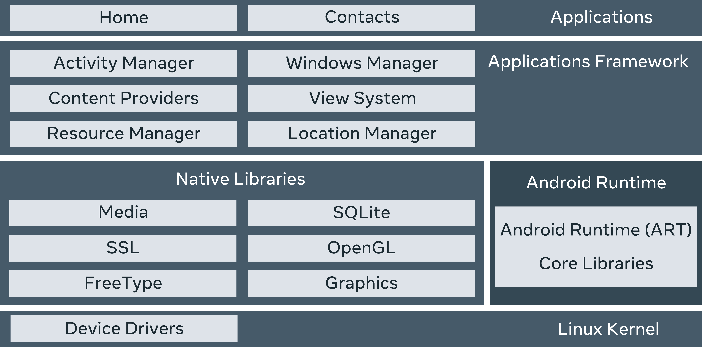

# Meta Android Developer Professional Certificate

## Introduction to Android Mobile Application Development

- Mobile Application -- Installable Software
  - Banking
  - Social Media
  - Retail
- Java, Kotlin, Android Studio, Components
- Mobile OS -- Android, iOS
  - Android released in 2008
    - based on a modifed linux kernel
- Kotlin -- concise and streamlined, easier maintenance, interoperable with java, java to kotlin conversion
- NFC - Near Field Communication
- ART - Android Runtime
- Android OS
  - 
- Top Level Components
  - Activity Components -- provides interactive content to user -- devs usually follow Single Activity architecture pattern
  - Android Views -- rectangular area on screen -- drawing and event handling
  - Android Layout Files -- blueprints for interface
    - Interfaces can be created using XML, Android Views, or Jetpack Compose. 
  - Project files -- config, code, resource
- Components
  - Activities -- single screen, window/frame
  - Services -- runs in brackground, updates activities and data
  - Broadcast Receivers -- respond to messages real-time; low on battery power notification is an example
  - Content Providers -- sharing data between applications
- `AndroidManifest.xml`
- XML Extensible Markup Language