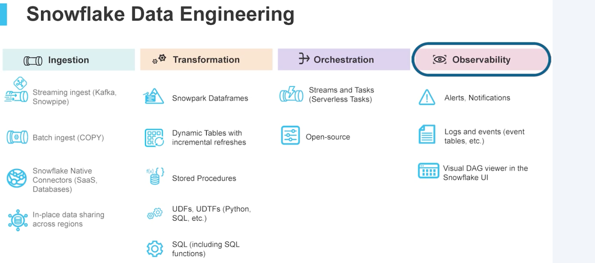
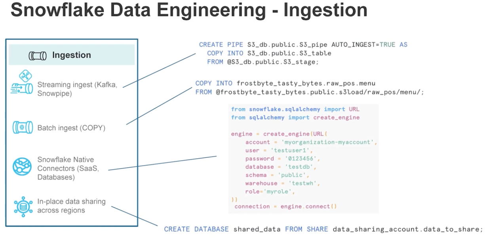
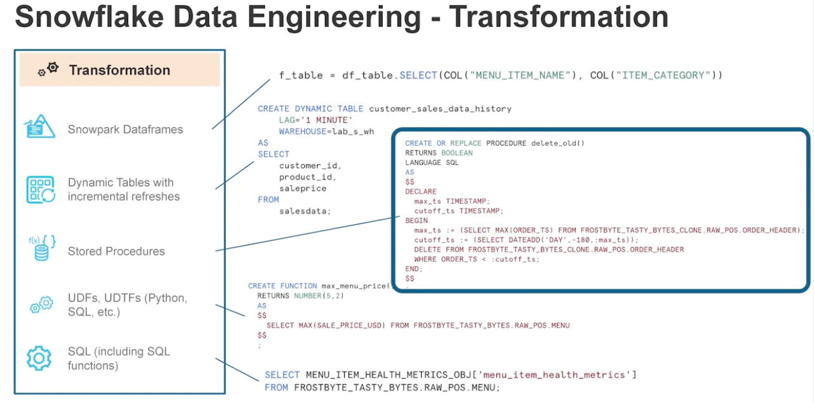
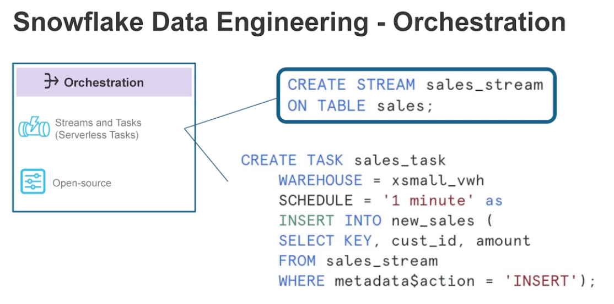

# Snowflake Data Engineering

## Intro to Snowflake for Devs, Data Scientists, Data Engineers

### Intro

[Signup for Snwoflake using this to get 120 days trial](https://signup.snowflake.com/?trial=student&cloud=aws&region=us-west-2&utm_source=coursera&utm_campaign=introtosnowflake)

- Snowflake as a data cloud
- Snowsight, snowflake UI

```sql
USE ROLE accountadmin;

USE WAREHOUSE compute_wh;

---> create the Tasty Bytes Database
CREATE OR REPLACE DATABASE tasty_bytes_sample_data;

---> create the Raw POS (Point-of-Sale) Schema
CREATE OR REPLACE SCHEMA tasty_bytes_sample_data.raw_pos;

---> create the Raw Menu Table
CREATE OR REPLACE TABLE tasty_bytes_sample_data.raw_pos.menu
(
    menu_id NUMBER(19,0),
    menu_type_id NUMBER(38,0),
    menu_type VARCHAR(16777216),
    truck_brand_name VARCHAR(16777216),
    menu_item_id NUMBER(38,0),
    menu_item_name VARCHAR(16777216),
    item_category VARCHAR(16777216),
    item_subcategory VARCHAR(16777216),
    cost_of_goods_usd NUMBER(38,4),
    sale_price_usd NUMBER(38,4),
    menu_item_health_metrics_obj VARIANT
);

---> create the Stage referencing the Blob location and CSV File Format
CREATE OR REPLACE STAGE tasty_bytes_sample_data.public.blob_stage
url = 's3://sfquickstarts/tastybytes/'
file_format = (type = csv);

---> query the Stage to find the Menu CSV file
LIST @tasty_bytes_sample_data.public.blob_stage/raw_pos/menu/;

---> copy the Menu file into the Menu table
COPY INTO tasty_bytes_sample_data.raw_pos.menu
FROM @tasty_bytes_sample_data.public.blob_stage/raw_pos/menu/;
```


<br/><br/>

Warehouse -- compute
- 10 sizes XS, S, M, L, XL, 2XL, 3XL, 4XL, 5XL, 6XL (2^0 ---> 2^9)

```sql
CREATE WAREHOUSE warehouse_name;
SHOW WAREHOUSES;
USE WAREHOUSE warehouse_name;
ALTER WAREHOUSE warehouse_name SET warehouse_size = MEDIUM;
ALTER WAREHOUSE warehouse_name SET AUTO_SUSPEND = 180 AUTO_RESUME = FALSE;
ALTER WAREHOUSE warehouse_name SUSPEND;
DROP WAREHOUSE warehouse_name;

CREATE WAREHOUSE multi_cluster_warehouse_name MAX_CLUSTER_COUNT = 3;
```


<br/><br/>

Stage -- Bridge between data source and table, intermediary
- external stage
- internal stage
  - user stage `@~` -- used only by user, cannot be dropped
  - table stage `@%` -- used only for associated table, cannot be dropped
  - named stage `@` -- used by multiple users for multiple tables

```sql
CREATE OR REPLACE FILE FORMAT frostbyte.public.csv_ff type = 'csv';

CREATE OR REPLACE STAGE frostbyte.public.s3load url = 's3://frostbyte/' file_format = frostbyte.public.csv_ff;

CREATE OR REPLACE STAGE frostbyte.public.internal_stage_test;

ls @frostbyte.public.s3load; -- lists all files in s3 bucket
-- named stages use @ for referencing them
-- table stages use @% for referencing them
-- user stages use @~ for referencing them

COPY INTO frostbyte.raw_pos.country FROM @frostbyte.public.s3load/raw_pos/country/;

SELECT file_name, error_count, status, last_load_time FROM snowflake.account_usage.copy_history order by last_load_time desc limit 10;
```


<br/><br/>

Databases and Schemas
- PUBLIC and INFORMATION_SCHEMA are default for every database
- SNOWFLAKE datbase is default for every snowflake account
- SNOWFLAKE_SAMPLE_DATA database comes with trial accounts

```sql
CREATE DATABASE db_name;
SHOW DATABASES; 
-- Kind -- STANDARD, APPLICATION, IMPORTED DATABASE
DESCRIBE DATABASE db_name;
DROP DATABASE db_name;
UNDROP DATABASE db_name;


CREATE SCHEMA test_schema;
SHOW SCHEMAS;
DROP SCHEMA test_schema;
UNDROP SCHEMA test_schema;
```


<br/><br/>

Tables 
- Stores data in micro partitions

Datatypes - 6 categories
1. Numeric -- NUMBER, DECIMAL, NUMERIC, INT, INTEGER, BIGINT, SMALLINT, TINYINT, BYTEINT, FLOAT, FLOAT4, FLOAT8, DOUBLE, DOUBLE PRECISION, REAL
2. String & Binary -- VARCHAR, CHAR, CHARACTER, STRING, TEXT, BINARY, VARBINARY
3. Logical -- BOOLEAN
4. Date & Time
5. Variant
6. Geography

```sql
CREATE TABLE table_name (col NUMERIC);
SHOW TABLES;
DROP TABLE table_name;
UNDROP TABLE table_name;

SELECT * FROM SNOWFLAKE.ACCOUNT_USAGE.TABLE_STORAGE_METRICS;
```


<br/><br/>

Views
- Standard non-materialized -- saved query
- Materialized -- no joins allowed; automatically updates when tables are updated

```sql
CREATE OR REPLACE VIEW frostbyte.harmonized.orders_v AS 
SELECT * FROM table;

DROP VIEW view_name;
SHOW VIEWS;
DESCRIBE VIEW view_name;
ALTER VIEW;

CREATE OR REPLACE MATERIALIZED VIEW frostbyte.harmonized.orders_materialized AS SELECT * FROM table;

SHOW MATERIALIZED VIEWS;
DESCRIBE MATERIALIED VIEW view_name;
DROP MATERIALIZED VIEW view_name;
```


<br/><br/>

Semi-Structured Data
- JSON, Avro, ORC, Parquet, XML
- VARIANT datatype -- flexible, can hold values of any datatype
- OBJECT -- key value pair
- ARRAY -- each element is VARIANT type

```sql
CREATE TABLE table_name (cost_of_goods VARIANT) AS SELECT cost_of_goods_usd::VARIANT FROM table_name;

SELECT TYPEOF(cost_of_goods) FROM variant_table;

SELECT menu_items_obj['menu_item_id'] FROM menu_table;
SELECT menu_items_obj:menu_item_id FROM menu_table;

SELECT * FROM menu_table m
LATERAL FLATTEN (input=> m.menu_item_health_metrics_obj:menu_item_health_metrics)
```


<br/><br/>

Snowflake Architecture
Layers
1. Optimized Storage -- structured, un-structured, semi-structured data; built on blob-storage
2. Elastic Multi Cluster Compute
3. Cloud Services -- maintenance, governance, networking, encryption
4. Snowgrid -- across regions and clouds (AWS, Azure, GCP)

### Intro to Snowfalke Features

Time Travel
- retention_time for standard tables is 1 day (for enterprise, can change this upto 90 days)

```sql
ALTER TABLE table_name SET DATA_RETENTION_TIME_IN_DAYS = 90;

SET good_data_query_id = LAST_QUERY_ID();
SELECT $good_data_query_id;

SET good_timestamp = CURRENT_TIMESTAMP;

SHOW VARIABLES;

-- query table as of a timestamp
SELECT * FROM table_name AT(TIMESTAMP => $good_time_stamp);
SELECT * FROM table_name AT(TIMESTAMP => '1900-01-01 00:00:00.000 -0700':: TIMESTAMP_LTZ);

-- as of seconds before now
SELECT * FROM table_name AT (OFFSET => -45);

SELECT * FROM table_name BEFORE(STATEMENT => $good_query_id);
```

<br/><br/>

Permanent, Transient, Temporary Tables
- Snowfalke provides additional 7day fail-save period after retention period has elapsed. 

```sql
CREATE TABLE -- creates permanent table; rentention period upto 9 days; only these have 7 day fail-safe backed by Snowflake 

CREATE TRANSIENT TABLE table_name CLONE table_name2; -- retention 0-1 day
-- last until dropped


CREATE TEMPORARY TABLE table_name CLOUNE table_name2; -- retention 0-1 day
-- last only for the session
```


<br/><br/>

Cloning and Resource Monitoring
- Zero Copy -- cost is incurred only when you start making changes to a Clone. 
- Account level (only one) and Warehouse level monitors
```sql
CREATE OR REPLACE DATABASE db_name CLONE db_name2; -- ZERO COPY -- no storage cost yet. 
-- once you make changes, storage costs incurr

CREATE OR REPLACE TABLE table_name CLONE table_name2 AT (OFFSERT => -60*10);

CREATE RESOURCE MONITOR monitor_name
WITH
    CREDIT_QUOTA = 20
    FREQUENCY = daily
    START_TIMESTAMP = immediately
    TRIGGERS
        ON 80 PERCENT DO NOTIFY -- notify accountadmins at 80%
        ON 100 PERCENT DO SUSPEND -- suspend warehouse, let queries finish
        ON 110 PERCENT DO SUSPEND_IMMEDIATE -- suspend warehouse and cancel all queries

SHOW RESOURCE MONITORS;

ALTER WAREHOUSE wh_name SET RESOURCE_MONITOR = monitor_name;
ALTER RESOURCE MONITOR monitor_name SET CREDIT_QUOTA = 30; 

DROP RESOURCE MONITOR monitor_name;
```


<br/><br/>

User Defined Functions UDFs
- always return scalar value
- can be python, java, sql, javascript, scala
- can use multiple UDFs in one SELECT statement

```sql
SHOW FUNCTIONS; -- lists all built in functions

-- Stored inside a database, so specify. Also, if you don't specify schema, it will just be public
CREATE FUNCTION max_menu_price()
RETURNS NUMBER(5, 2)
AS
$$
    SELECT MAX(SALE_PRICE_USD) FROM menu_table;
$$

CREATE FUNCTION max_menu_price_converted(USD_to_new NUMBER)
RETURNS NUMBER(5, 2)
AS
$$
    SELECT USD_TO_NEW * MAX(SALE_PRICE_USD) FROM menu_table;
$$

SELECT max_menu_price_converted(1.35);

CREATE FUNCTION winsorsize (val NUMERIC, up_bound NUMERIC, low_bound NUMERIC)
RETURNS NUMERIC
language_python
runtime_version = '3.11'
handler = 'winsorize_py'
AS
$$
def winsorize_py(val, up_bound, low_bound):
    if val > up_bound:
        return up_bound;
    elif val < low_bound:
        return low_bound;
    else:
        return val;
$$;

SELECT winsorize(12, 11, 4)
```


<br/><br/>

User Defined Table Functions UDTFs
- can not be in scala

```sql
CREATE FUNCTION menu_prices_above(price_floor NUMBER)
RETURNS TABLE (item VARCHAR, price NUMBER)
AS
$$
    SELECT menu_item, price FROM table_name WHERE price > price_floor
$$;

SELECT * FROM TABLE(menu_prices_above(15)) WHERE item ilike '%CHICKEN%';
```


<br/><br/>

Stored Procedures
- you need separate call for each stored procedure

```sql
SHOW PROCEDURES;

SET cutoff_ts = (SELECT DATEADD('DAY', -180, $max_ts));

CREATE OR REPLACE PROCEDURE delete_old()
RETURNS BOOLEAN
LANGUAGE SQL
AS
$$
DECLARE
    max_ts TIMESTAMP;
    cutoff_ts TIMESTAMP;
BEGIN
    max_ts := (SELECT MAX(order_ts) FROM table_name);
    cutoff_ts := (SELECT DATEADD('DAY', -180, :max_ts));
    DELETE FROM table_name WHERE order_ts < :cutoff_ts;
END
$$

DESCRIBE PROCEDURE procedure_name();

CALL delete_old();
```


<br/><br/>

Role Based Access Control RBAC
- Securable Objects, Privileges, Roles, Users
- every account has 6 main roles automatically
  - orgadmin -- spans multiple accounts
  - accountadmin
  - securityadmin
  - useradmin
  - sysadmin
  - public
- you grant privileges to roles  -- buckets of privileges

```sql
CREATE ROLE role_name;
SHOW GRANTS TO ROLE role_name; -- lists privileges granted
GRANT ROLE role_name TO USER user_name;

GRANT CREATE WAREHOUSE ON ACCOUNT TO ROLE role_name;
```


<br/><br/>

Snowpark DataFrames and VS Code Extension
- Python UDFs, Python Stored Procedures, DataFrames, ML, Container Services, ...
- Ingestion, Transformation, Delivery -- ITD

```py
import snowflake.snowpark as snowpark
from snowflake.snowpark.functions import col

def main(session: snowpark.Session):
    df_table = session.table("db.schema.table_name")

    df_table.show() # does the actual computations if any (say filter etc) -- LAZY EXECUTION

    df_table2 = session.sql("SELECT * FROM table_name")

    df_table = df_table.filter(col["COLNAME"] == "MYVALUE")
    # doesn't actually filter until df_table.show() is called

    df_table = df_table.select(col("COL1"), col("COL2"))


    df_table.write.save_as_table("db.schema.new_table_name", mode="append") # mode="overwrite"

    return df_table
```


<br/><br/>

Snowflake CLI


```bash
pip install snowflake-cli-labs
snow --help
snow --info

vim config.toml # :q quit
cd ~ # prev location

snow app --help
snow connection --help # config.toml
snow object --help 
```

### Intro to Overview of Builder Workloads

Workloads -- Applications, Collaboration, Data Engineering, Data Lake, Unistore, AI/ML, Data Warehouse, Cybersecurity





Dynamic tables -- similar to materialized views (update right away as underlying table changes), these let you select a refresh rate of 1 minute or more. 





Stream -- tracks changes to table


<br/><br/>

Snowpipe
- AWS Access Policy, AWS Role

```sql
CREATE OR REPLACE STORAGE INTEGRATION S3_role_integration
    TYPE = EXTERNAL_STAGE
    STORAGE_PROVIDER = S3
    ENABLED = TRUE
    STORAGE_AWS_ROLE_ARN = "arn:aws:iam::3984248293:role/snwoflake_role_"
    STORAGE_ALLOWED_LOCATIONS = ("s3://intro-to-snowflake-snowpipe/");
```


## Introduction to Modern Data Engineering With Snowflake


## Advanced Data Engineering with Snowflake


